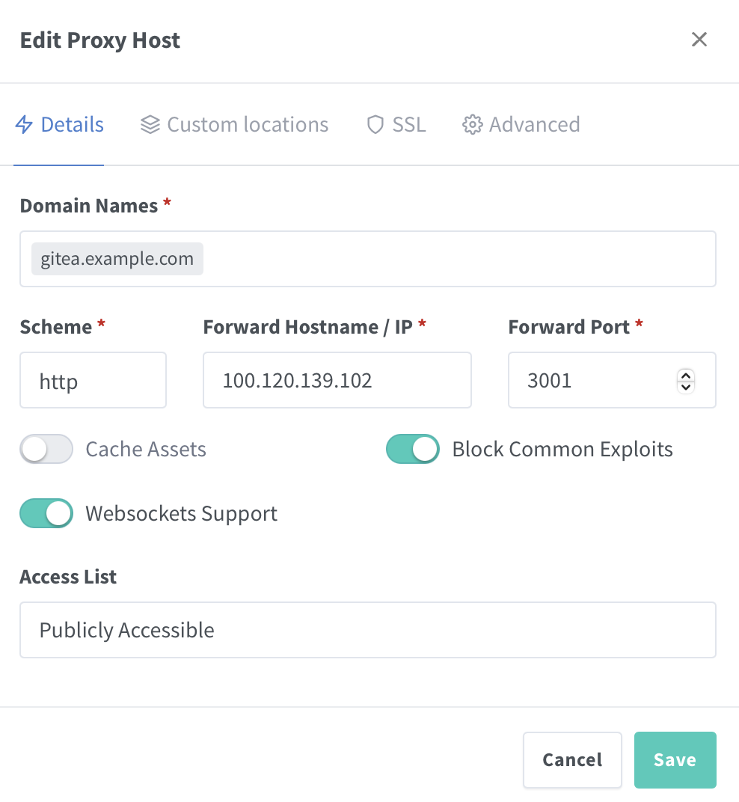

# Gitea

Private, Fast, Reliable DevOps Platform.
Brings teams and developers high-efficiency but easy operations from planning to production.

# 📦 Gitea Docker Compose Stack

[](LICENSE)
[](https://woodpecker-ci.org/)
[](https://hub.docker.com/r/Gitea/Gitea)
[](https://man7.org/linux/man-pages/man1/envsubst.1.html)
[](https://openzfs.org/)

This repository contains a minimal and production-ready [Gitea](https://Gitea.net/) stack using Docker Compose. Gitea is a network-wide ad blocker that acts as a DNS sinkhole and optionally a DHCP server.

---

## 📁 Directory Structure

```bash
tank/
├── docker/
│   ├── compose/
│   │   └── gitea/              # Git repo lives here
│   │       ├── docker-compose.yml  # Main Docker Compose config
│   │       ├── .env                # Runtime environment variables and secrets (gitignored!)
│   │       ├── env.example         # Example .env file for reference
│   │       ├── env.template        # Optional template
│   │       └── README.md           # This file
│   └── data/
│       └── gitea/              # Volume mounts and persistent data
```

---

## 🧰 Prerequisites

* Docker Engine
* Docker Compose V2
* Git
* (Optional) ZFS on Linux for dataset management

> ⚠️ **Note:** These instructions assume your ZFS pool is named `tank`. If your pool has a different name (e.g., `rpool`, `zdata`, etc.), replace `tank` in all paths and commands with your actual pool name.

---

## ⚙️ Setup Instructions

1. **Create the stack directory and clone the repository**

   If using ZFS:
   ```bash
   sudo zfs create -p tank/docker/compose/gitea
   cd /tank/docker/compose/gitea
   sudo git clone https://github.com/Vantasin/Gitea.git .
   ```

   If using standard directories:
   ```bash
   mkdir -p ~/docker/compose/gitea
   cd ~/docker/compose/gitea
   git clone https://github.com/Vantasin/Gitea.git .
   ```

2. **Create the runtime data directory** (optional)

   If using ZFS:
   ```bash
   sudo zfs create -p tank/docker/data/gitea
   ```

   If using standard directories:
   ```bash
   mkdir -p ~/docker/data/gitea
   ```

3. **Configure environment variables**

   Copy and modify the `.env` file:

   ```bash
   sudo cp env.example .env
   sudo nano .env
   sudo chmod 600 .env
   ```

   > Alternatively generate the `.env` file using the `env.template` template with Woodpecker CI's `.woodpecker.yml`.

4. **Start Gitea**

   ```bash
   docker compose up -d
   ```

---

## 🌐 Accessing Gitea Web UI

Once deployed, access Gitea using:

- **Web Interface (HTTP):** `http://localhost:88/admin` or replace `localhost` with your server’s IP address.  
- **Admin Password:** Must be set via `WEBPASSWORD` in `.env` or a random password will be generated.

> **Note:** Consider using [Nginx Proxy Manager](https://github.com/Vantasin/Nginx-Proxy-Manager.git) as a reverse proxy for HTTPS certificates via Let's Encrypt.

<p align="center">
  
</p>

> **Note:** Consider using [Tailscale](https://tailscale.com/) then setting `Global nameservers` to your host server's (the server running Gitea) Tailscale IP address and enabling `Override DNS servers`. This will make Gitea the sole DNS resolver for all devices on your Tailscale network and will allow Gitea to filter domains thereby blocking Ads.

<p align="center">
  
</p>

---

## 🙏 Acknowledgments

- [ChatGPT](https://openai.com/chatgpt) for assistance in generating setup scripts and templates.
- [Gitea/docker-Gitea](https://github.com/Gitea/docker-Gitea) the official Docker image and source code for Gitea.
- [Gitea documentation](https://docs.Gitea.net/) the official user guide and admin reference for configuring and troubleshooting Gitea.
- [Docker](https://www.docker.com/) for container orchestration and runtime.
- [`envsubst`](https://man7.org/linux/man-pages/man1/envsubst.1.html) for lightweight environment variable substitution in template files.
- [Woodpecker CI](https://woodpecker-ci.org/) for lightweight, self-hosted continuous integration.
- [ZFS](https://openzfs.org/) for advanced local filesystem features, dataset organization, and snapshotting.
